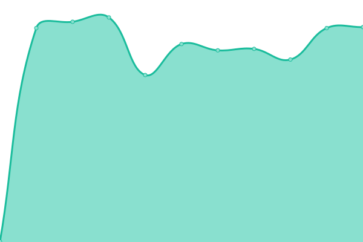
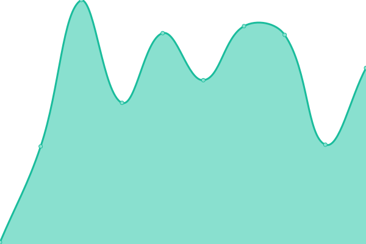

# 

<!--start: status pages-->
<!-- This summary is generated by Upptime (https://github.com/upptime/upptime) -->
<!-- Do not edit this manually, your changes will be overwritten -->

| URL                                                                                   | Status | History                                                                                                | Response Time                                                                      | Uptime                                                                                                                                                                                                                           |
| ------------------------------------------------------------------------------------- | ------ | ------------------------------------------------------------------------------------------------------ | ---------------------------------------------------------------------------------- | -------------------------------------------------------------------------------------------------------------------------------------------------------------------------------------------------------------------------------- |
| [Mog (dev)](http://ec2-13-125-98-107.ap-northeast-2.compute.amazonaws.com:30000)      | 🟩 Up  | [mog-dev.yml](https://github.com/Cravemob/mog-status/commits/master/history/mog-dev.yml)               |  305ms       |                |
| [Mog (production)](http://ec2-15-223-29-142.ca-central-1.compute.amazonaws.com:30000) | 🟩 Up  | [mog-production.yml](https://github.com/Cravemob/mog-status/commits/master/history/mog-production.yml) |  75ms |  |

<!--end: status pages-->
